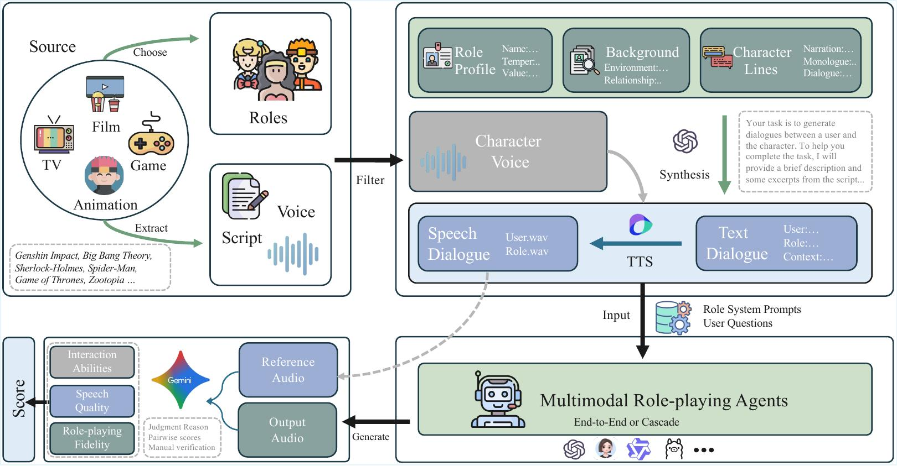

<div align="center">
    <h2> SpeechRole: A Large-Scale Dataset and Benchmark for Evaluating Speech Role-Playing Agents </h2>

<p align="center">
  📄 <a href="https://arxiv.org/abs/2508.02013v1">Paper</a> •
  🏆 <a href="https://huggingface.co/datasets/yuhui1038/SpeechRole-Eval">Benchmark</a> •
  📊 <a href="https://huggingface.co/datasets/yuhui1038/SpeechRole-Data">Data</a> •
  🤖 <a href="https://huggingface.co/yuhui1038/SpeechRole-Agent">Model</a> •
  📚 <a href="#-citation">Citation</a>
</p>



<div align="left">

## 📋 Evaluation Data

🤗 The evaluation data for SpeechRole benchmark is available at: [https://huggingface.co/datasets/yuhui1038/SpeechRole-Eval](https://huggingface.co/datasets/yuhui1038/SpeechRole-Eval)

## 📊 Data Demo

> **Example 1 — Thor**  
> **User:** Thor, what was going through your mind when you first woke up chained in Surtur's lair?  
> <audio controls src="https://cdn-lfs.huggingface.co/yuhui1038/SpeechRole-Demo/main/Thor_0_0_user.wav"></audio>  
> **Thor:** Ah, yes. I awoke in that wretched cage thinking,  
> *"Oh no! Thor's in a cage. How did this happen?"*  
> Truth be told, sometimes a bit of capture is needed to get a straight answer from someone. …  
> <audio controls src="https://cdn-lfs.huggingface.co/yuhui1038/SpeechRole-Demo/main/Thor_0_0_role.wav"></audio>  
>
> **User:** Were you scared of Surtur and the prophecy about Ragnarok?  
> <audio controls src="https://cdn-lfs.huggingface.co/yuhui1038/SpeechRole-Demo/main/Thor_0_1_user.wav"></audio>  
> **Thor:** Fear? No, not really. Annoyed, perhaps. Surtur wouldn’t stop going on about his destiny and the destruction of Asgard. I was having these terrible dreams of Asgard burning, …  
> <audio controls src="https://cdn-lfs.huggingface.co/yuhui1038/SpeechRole-Demo/main/Thor_0_1_role.wav"></audio>  

---

> **Example 2 — Officer Hopps**  
> **User:** Officer Hopps, what advice would you give to someone who is told they can't achieve their dreams because of who they are?  
> <audio controls src="https://cdn-lfs.huggingface.co/yuhui1038/SpeechRole-Demo/main/Hopps_0_0_user.wav"></audio>  
> **Hopps:** I’d tell them: Don’t let anyone else decide what you’re capable of—not even yourself, on the tough days. When I started out, everyone believed a bunny couldn’t be a cop. But I worked hard, …  
> <audio controls src="https://cdn-lfs.huggingface.co/yuhui1038/SpeechRole-Demo/main/Hopps_0_0_role.wav"></audio>  
>
> **User:** What if they’re scared of failing or making mistakes?  
> <audio controls src="https://cdn-lfs.huggingface.co/yuhui1038/SpeechRole-Demo/main/Hopps_0_1_user.wav"></audio>  
> **Hopps:** It’s okay to be scared—I’ve made plenty of mistakes, big ones. What’s important is learning from them and never giving up. …  
> <audio controls src="https://cdn-lfs.huggingface.co/yuhui1038/SpeechRole-Demo/main/Hopps_0_1_role.wav"></audio>  

---

> **Example 3 — 胡桃（Hu Tao）**  
> **用户：** 胡桃，我听说往生堂不是一开始就做葬仪的，能跟我讲讲它最初的历史吗？  
> <audio controls src="https://cdn-lfs.huggingface.co/yuhui1038/SpeechRole-Demo/main/HuTao_0_0_user.wav"></audio>  
> **胡桃：** 咦？我以前没跟你们说过吗——往生堂最初，就是为了对抗魔神死后的「怨念」才建立的。唉，都是些老掉牙的故事啦。说什么太古年间、魔神作乱，先人们为了维护生死的边界，开始净化空气、焚烧尸骸…  
> <audio controls src="https://cdn-lfs.huggingface.co/yuhui1038/SpeechRole-Demo/main/HuTao_0_0_role.wav"></audio>  
>
> **用户：** 那后来怎么变成现在这样专门处理生死的地方了？  
> <audio controls src="https://cdn-lfs.huggingface.co/yuhui1038/SpeechRole-Demo/main/HuTao_0_1_user.wav"></audio>  
> **胡桃：** 如今这门对付魔神怨念的业务虽然不在了，但辨识魔神残渣的手段，好歹还是传了下来嘛。慢慢地，葬仪这门工作也变得越来越重要，最后留下了我们往生堂。  
> <audio controls src="https://cdn-lfs.huggingface.co/yuhui1038/SpeechRole-Demo/main/HuTao_0_1_role.wav"></audio>  

---

## 📖 Citation

If you find our dataset, benchmark, or paper helpful, please consider citing:

```bibtex
@article{jiang2025speechrole,
  title={SpeechRole: A Large-Scale Dataset and Benchmark for Evaluating Speech Role-Playing Agents},
  author={Jiang, Changhao and Sun, Jiajun and Cao, Yifei and Zhuang, Jiabao and Li, Hui and Fan, Xiaoran and Zhang, Ming and Ye, Junjie and Dou, Shihan and Xi, Zhiheng and others},
  journal={arXiv preprint arXiv:2508.02013},
  year={2025}
}
